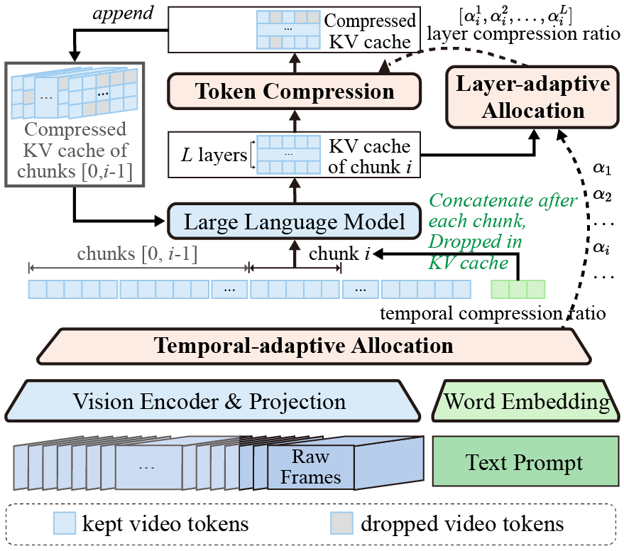

# FlexReduc: Flexible Redundancy Reduction to Perceive Longer for Video-language Understanding

FlexReduc, also known as AdaReTaKe, is an advanced video compression method designed for MLLMs to effectively reduce context length, breaking the “memory wall” to enable longer video perception with improved performance. It adaptively reduces uneven visual redundancy across timestamps and MLLM layers, extending model capacity from 256 to 2048 frames for long video understanding. By introducing an adaptive compression ratio allocation strategy, FlexReduc theoretically minimizes compression loss and achieves state-of-the-art results, outperforming existing MLLMs by an average of 2.3% and 2.8% across four datasets for 7B and 72B models, respectively.

---

## 🚀 Key Contributions

- We identify uneven visual redundancy across timestamps and MLLM layers and develop FlexReduc to adaptively reduce it, expanding MLLM capacity from 256 to 2048 frames for long video understanding.
-  We design an adaptive compression ratio allocation method across timestamps and MLLM layers, with theoretical analysis showing that layer-wise allocation minimizes the upper bound of compression loss.

<p align="center">
  
</p>

---

## ⚙️ Environment Setup

### For GPU Users:
```bash
conda env create -f environment.yaml
```

### For NPU Users:
```bash
conda env create -f environment_npu.yaml
```

### Additional Dependencies:
```bash
pip install git+https://github.com/huggingface/transformers.git@f3f6c86582611976e72be054675e2bf0abb5f775
apt-get install ffmpeg  # Required for full functionality; quick demo does not require ffmpeg.
```

---

## 🖥️ Quick Demo

### Step 1: Update Configuration
Modify the `hf_qwen2vl7b_path` in `./demo.py` to point to your local path for `Qwen2-VL-7B-Instruct`.  
For NPU users, also update `config_path` to `'configs/demo_npu.yaml'`.

### Step 2 (Optional for LLaVA-Video): Convert Model
```bash
# Convert LLaVA-Video model into Hugging Face format
# Ensure the following models are downloaded: Qwen2-7B-Instruct, siglip-so400m-patch14-384, and LLaVAVideoQwen2_7B.
python scripts/utils/convert_llava_video_weights_to_hf.py \
  --text_model_id /path_to/Qwen2-7B-Instruct \
  --vision_model_id /path_to/siglip-so400m-patch14-384 \
  --output_hub_path /path_to/llava-video-qwen2-7b-hf \
  --old_state_dict_id /path_to/LLaVAVideoQwen2_7B
```

### Step 3: Run the Demo
```bash
python demo.py
```

---

## 📊 Reproducing FlexReduc Results

### Step 1: Prepare Datasets
Follow the documentation to prepare the required datasets:
- [VideoMME](docs/prepare_videomme.md)
- [MLVU](docs/prepare_mlvu.md)
- [LongVideoBench](docs/prepare_longvideobench.md)
- [LVBench](docs/prepare_lvbench.md)

### Step 2: Run Inference and Evaluation
Use the provided script to perform inference and evaluation:
```bash
bash scripts/infer_eval.sh ${YOUR_PATH_TO_Qwen2.5-VL-7B-Instruct} configs/qwen2_5_vl/flexreduc_qwen2-5-vl_videomme.yaml 8
bash scripts/infer_eval.sh ${YOUR_PATH_TO_Qwen2.5-VL-7B-Instruct} configs/qwen2_5_vl/flexreduc_qwen2-5-vl_mlvu.yaml 8
bash scripts/infer_eval.sh ${YOUR_PATH_TO_Qwen2.5-VL-7B-Instruct} configs/qwen2_5_vl/flexreduc_qwen2-5-vl_longvideobench.yaml 8
bash scripts/infer_eval.sh ${YOUR_PATH_TO_Qwen2.5-VL-7B-Instruct} configs/qwen2_5_vl/flexreduc_qwen2-5-vl_lvbench.yaml 8
```

- Results will be saved in the `./results` directory.